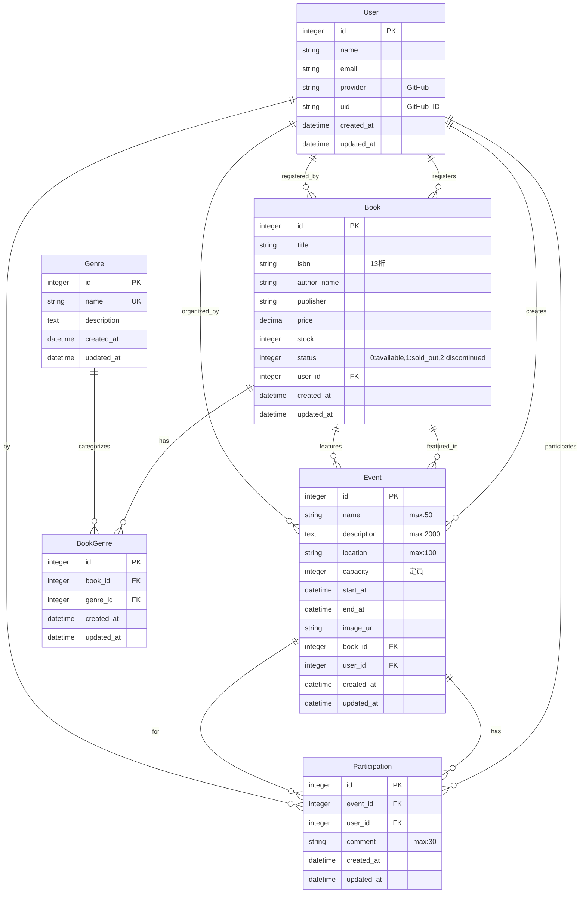

# EventHub ER図

---

## リレーション一覧

### User（ユーザー）
- `has_many :books` - 登録した技術書
- `has_many :events` - 主催したイベント
- `has_many :participations` - 参加したイベント
- `has_many :participated_events, through: :participations, source: :event`

### Book（技術書）
- `belongs_to :user` - 登録者
- `has_many :book_genres, dependent: :destroy`
- `has_many :genres, through: :book_genres` - ジャンル（多対多）
- `has_many :events` - この本に関連するイベント

### Genre（ジャンル）
- `has_many :book_genres, dependent: :destroy`
- `has_many :books, through: :book_genres` - 技術書（多対多）

### BookGenre（中間テーブル）
- `belongs_to :book`
- `belongs_to :genre`

### Event（イベント）
- `belongs_to :book` - 関連書籍
- `belongs_to :user` - 主催者
- `has_many :participations, dependent: :destroy`
- `has_many :participants, through: :participations, source: :user`

### Participation（イベント参加）
- `belongs_to :event`
- `belongs_to :user`

---

## キーポイント

### 多対多リレーション
1. **Book ←→ Genre**
   - 中間テーブル: `BookGenre`
   - 例: 「パーフェクトRails」は "Ruby" と "Rails" の両ジャンル

2. **User ←→ Event（参加者として）**
   - 中間テーブル: `Participation`
   - 例: あるユーザーが複数のイベントに参加

### Enum
- `Book.status`
  - `0`: available（販売中）
  - `1`: sold_out（売り切れ）
  - `2`: discontinued（販売終了）

### インデックス
- `Book.isbn` - ユニーク制約
- `User.email` - ユニーク制約
- `BookGenre(book_id, genre_id)` - 複合ユニーク制約
- `Participation(event_id, user_id)` - 複合ユニーク制約
